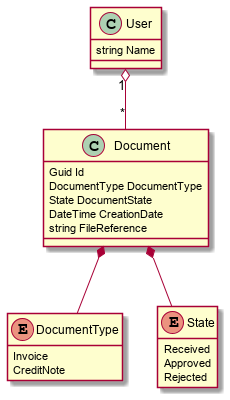

# Sproom Inbox job interview case

To see how you write and structure code, we'd like you to build a simple solution for an "inbox" like application, where several users have several documents that they can approve or reject.

 - Main entity is a document containing at least: Id, Document type ("invoice" or "credit note") Reference to file, Creation date, Current state
 - Each document must have a current state, and a history of state changes. Possible states are: Received, Approved, Rejected
 - A user can see a list of their documents and approve or reject them
 - When a document is approved, it is forwarded to an e-mail address. The actual e-mail forwarding need not to be implemented for this excercise (just have a dummy method for it)

The documents are served by a public REST API and user interaction is done via a web application. Some diagrams to illustrate the idea.

We are aware that everything is not 100% well specified here (is anything ever?). You are expected to fill in the blanks as you see fit. If you feel that something is very unclear, you are of course welcome to contact us and ask about it.

## Requirements

### The REST API 
 - Should be able to list documents - preferably with some kind of search/query
 - Should be able to update document states
 - Should be documented
 - Should be backed by some kind of Database of your choosing

### The web app
 - Should be able to list documents and update document states (approve or reject).
 - When a document is approved, it must call some "forward to e-mail method"
 - Graphical design/layout is not a focus point, we don't expect you to be a designer

 ### General requirements
 The API must be implemented in C#. You choose the rest of the techonologies to use. We use the following in Sproom, but you do NOT have to stick with these:
  - Blazor WebAssembly for frontend - but also some React and some ASP.NET MVC
  - MS SQL Server for database - but also some PostgresSQL
  - Mainly .NET Framework for now, but also some .NET 6.0 and dreaming of migrating main code base to that
  - NUnit, FluentAssertions and NSubstitute for unit tests and mocking
  - Messaging (via Azure ServiceBus queues)

### We would like to see
  - That the implemented parts are working
  - Reasonably structured code
  - Some tests to show how you would go about testing the code

### We do not expect
  - That the solution is complete
  - That the solution is production ready
  - Authentication and encryption to be implemented (http and no login is perfectly acceptable). User id's or similar can just be given as headers/parameters as you see fit. We will however most likely talk about security considerations in the interview